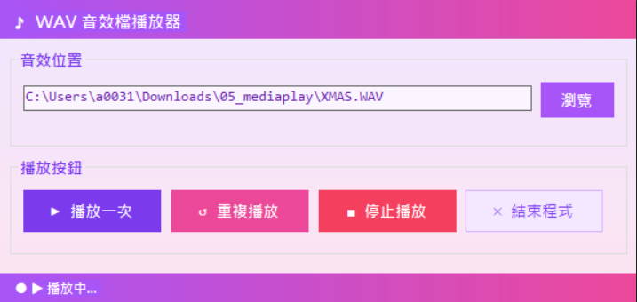

# WAV 音效檔播放器
視窗程式設計 (II) 上課練習

## 功能介紹

* 透過瀏覽對話框選取 WAV 音效檔案
* 播放一次或重複循環播放音效
* 隨時停止播放
* 底部狀態列即時顯示播放狀態
* 關閉視窗前跳出確認對話框

## 使用方式

1. 點擊「瀏覽」選取 WAV 音效檔案
2. 點擊「播放一次」播放單次音效
3. 點擊「重複播放」持續循環播放
4. 點擊「停止播放」中止音效
5. 點擊「結束程式」或關閉視窗退出應用程式

## 執行畫面

## 開發環境

* C#
* Windows Forms
* Visual Studio

## 備註

* 選取檔案前播放相關按鈕為停用狀態